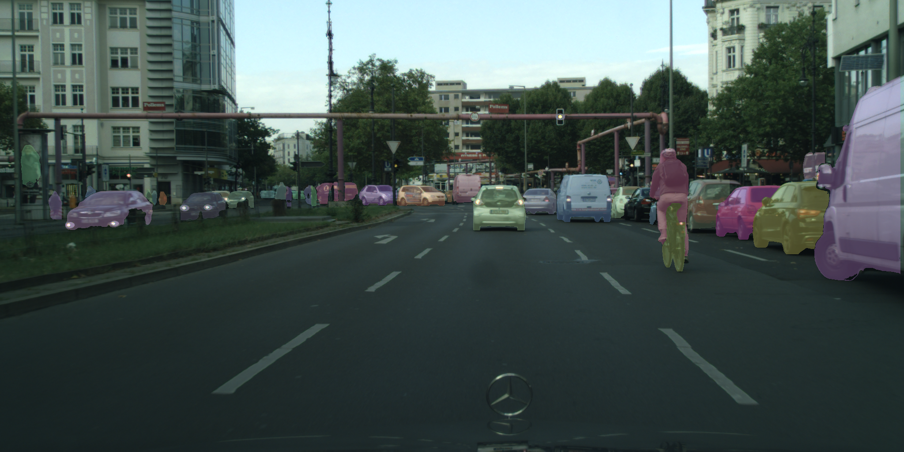

# instance segmentation based one stage object detector and spatial embeddings
This project implements a new approach for instance segementation.
## requirements
The dependencies are as following:
* pytorch v1.3+
* torchvision v0.4.0+
* pycocotools v2.0.0
* torchsummary v1.5.1
* opencv-python v4.0.0+
* tqdm v4.43.0+
* sklearn
* Cython v0.29.15+
### install dependency
```shell script
pip install -r pip-requirements.txt
pip install torch===1.4.0 torchvision===0.5.0 -f https://download.pytorch.org/whl/torch_stable.html
```
## train
The dataset only support the cityscapes, the train command as following:
```shell script
python train.py 
    --cfg_path ./configs/train_cfg.yaml 
```

## demo imgs

